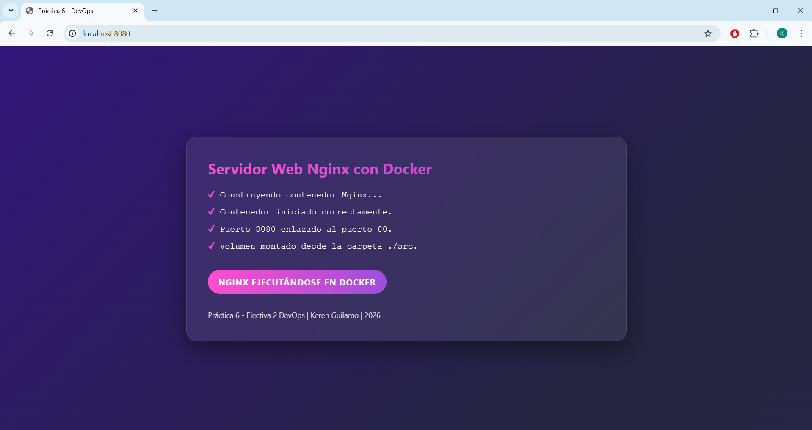
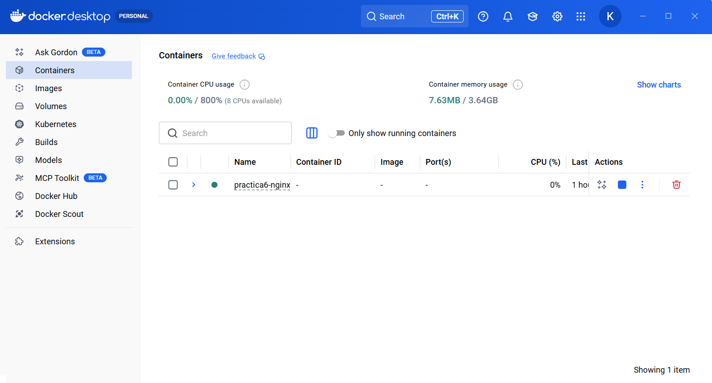

# Servidor Web Nginx con Docker

Proyecto académico desarrollado para la Práctica 6 de la asignatura Electiva 2 - DevOps.

Este proyecto consiste en la creación de una página web personalizada desplegada dentro de un contenedor Docker utilizando Nginx como servidor web.

El objetivo es demostrar conocimientos prácticos en contenerización, despliegue y buenas prácticas de organización de proyectos.

---

## Tecnologías Utilizadas

- HTML5
- CSS3
- Docker
- Nginx
- Git
- GitHub

---

## Estructura del Proyecto

```
proyecto/
│
assets/
│
├── web.png
├── docker.png
└── docker-desktop.png 
│
│
├── src/
│   ├── index.html
│   └── styles.css
│
├── Dockerfile
└── README.md
```

---

## Funcionamiento

El proyecto utiliza la imagen oficial de Nginx para servir archivos estáticos.

El contenedor realiza las siguientes acciones:

- Construye una imagen personalizada basada en Nginx.
- Copia los archivos del directorio `src` al directorio público `/usr/share/nginx/html/`.
- Expone el puerto 80 del contenedor.
- Mapea el puerto 8080 del host al puerto 80 del contenedor.

---

## Construcción y Ejecución

### 1. Construir la imagen

```bash
docker build -t web-profesional .
```

### 2. Ejecutar el contenedor

```bash
docker run -d -p 8080:80 --name web-contenedor web-profesional
```

### 3. Acceder desde el navegador

Abrir en el navegador:

http://localhost:8080

---

## Evidencia Visual

### Vista de la Aplicación



---

### Contenedor en Ejecución (Docker Desktop)



---

## Objetivos del Proyecto

- Comprender el flujo completo de construcción y ejecución de contenedores.
- Implementar una aplicación web estática personalizada.
- Aplicar buenas prácticas de organización de código.
- Documentar el proyecto de forma profesional.

---

## Buenas Prácticas Aplicadas

- Separación de estructura (HTML) y estilos (CSS).
- Uso de imagen oficial de Nginx.
- Nombres descriptivos para imagen y contenedor.
- Documentación clara y estructurada.
- Organización profesional del repositorio.

---

## Posibles Mejoras Futuras

- Implementar Docker Compose.
- Agregar variables de entorno.
- Configurar HTTPS.
- Automatizar despliegue con integración continua.
- Publicar la imagen en Docker Hub.

---

## Autor

Keren Guilamo  
Electiva 2 - DevOps  
2026